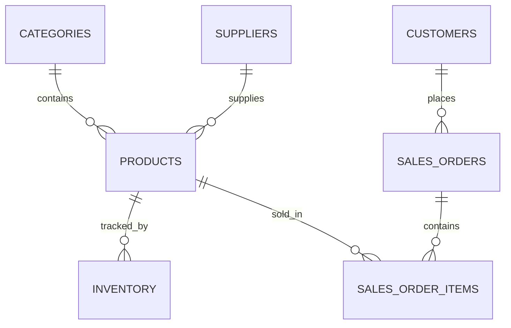

# Comprehensive Project Documentation: Inventory Management System

This document serves as the **Master Guide** for the Inventory Management System. It consolidates the architecture, design decisions, database workflow, and technical stack into one place so you can easily explain the entire project from top to bottom.

---

## 1. Executive Summary
The Inventory Management System is an enterprise-grade backend application acting as a central hub for business operations. It tracks stock levels across warehouses, manages suppliers and customers, and maintains an unbreakable audit trail of stock movements to prevent stockouts and data loss.

It features a **Dual Interface**:
1. **HTML Web Dashboard**: A server-side rendered UI built with Django Templates for browser-based management.
2. **RESTful API**: A secure JSON API for mobile applications or decoupled frontends.

---

## 2. Technical Stack & Infrastructure
The project uses a modern, robust technology stack designed for scalability and reliability.

* **Language**: Python 3.11+
* **Framework**: Django 5.1 & Django REST Framework (DRF)
* **Database**: PostgreSQL 15
* **Server Infrastructure**: Docker, Nginx, Gunicorn
* **Security/Auth**: JSON Web Tokens (JWT) & Role-Based Access Control

### Docker Architecture (The 3-Tier Setup)
The application is fully containerized using Docker to ensure it runs identically in development and production.
1. **Nginx (Reverse Proxy - Port 80)**: Intercepts web traffic, instantly serves static files (CSS/Images), and forwards Python-specific logic to the web app. It acts as a security shield.
2. **Django Web App (Application Server - Port 8000)**: Runs the core Python logic via Gunicorn.
3. **PostgreSQL DB (Database - Port 5432)**: An isolated container that safely stores all relational data.

---

## 3. Backend Design Patterns

### A. The "Modular Monolith" Architecture
Instead of building complex microservices, the code is strictly separated into independent "apps" (Accounts, Products, Orders, Inventory) inside one repository. This provides the organizational benefits of microservices without the heavy server management overhead.

### B. The "Service Layer" Pattern
Business logic (like calculating totals or deducting stock) is strictly removed from API views and placed in `services.py` files. 
* **Benefit**: The logic can be reused by both the API and the HTML dashboard, and it makes automated testing significantly easier.

### C. Decoupling via Django Signals
When inventory is adjusted, a "Signal" is fired. A separate logging module listens for this signal and records an Audit Trail. The core inventory logic doesn't even know the logging is happening, which keeps the code incredibly clean.

---

## 4. Database Architecture & Workflow

PostgreSQL was chosen over SQLite or MongoDB because inventory data requires strict relational integrity (ACID compliance) to prevent race conditions (e.g., two people buying the last item at the exact same time).

### Data Workflow hierarchy:
1. **Master Data First**: Users must create `Categories` and `Suppliers` before they can do anything else.
2. **Products**: `Products` are created and linked to their respective Category and Supplier via Foreign Keys.
3. **Inventory Tracking**: A `Stock` record is assigned to the Product to track the quantity-on-hand.
4. **Transactions (Orders)**: When a `SalesOrder` is placed, the system checks stock levels, creates the order, and deducts the inventory.

### Atomic Transactions
During an order checkout, the database uses `@transaction.atomic`. This ensures that if the system crashes exactly after deducting stock but before saving the receipt, the *entire* database rolls back to its previous state. Data cannot be corrupted.

---

## 5. Security & Authentication

1. **Role-Based Access Control (RBAC)**: The custom `User` model defines 3 strict roles:
   * `ADMIN`: Full system access.
   * `INVENTORY_MANAGER`: Can adjust stock and manage products.
   * `CUSTOMER`: Can only place orders and view history.
2. **JSON Web Tokens (JWT)**: The API uses stateless authentication. Users log in and receive an Access Token and a Refresh Token, allowing the server to securely verify identity without heavy database queries.
3. **Environment Security**: Sensitive keys (`SECRET_KEY`, `DB_PASSWORD`) are loaded dynamically via `.env` files and never committed to GitHub.

---

## 6. Project Directory Structure
* **`/apps/`**: Contains the modular business logic (`accounts`, `categories`, `products`, `inventory`, `orders`).
* **`/config/`**: Contains the global settings (`settings.py`) and URL routing.
* **`/static/` & `/media/`**: Stores CSS files and user-uploaded product images.
* **`docker-compose.yml` & `Dockerfile`**: Defines the infrastructure and container environments.
* **`manage.py`**: The main entry point for Django commands (running the server, migrating the database).
