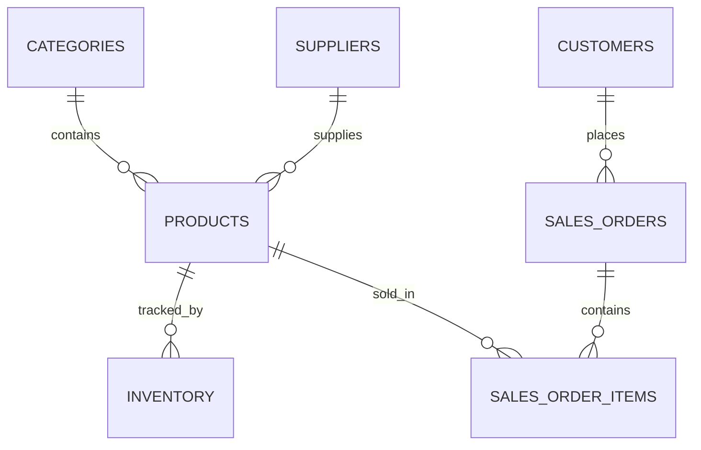

# INVENTORY MANAGEMENT SYSTEM
## Project Documentation

**Technology Stack:** Django, Django REST Framework, PostgreSQL  
**Backend:** Python / Django  
**API Framework:** Django REST Framework (DRF)  
**Database:** PostgreSQL (SQLite for local dev)  
**Testing:** Django Test Framework  
**Deployment:** Docker, Gunicorn, Nginx  

---

## 1. PROJECT OVERVIEW

### 1.1 Introduction
The Inventory Management System is a web-based backend application developed using Django, Django REST Framework (DRF), and PostgreSQL. 

The main purpose of the system is to digitally manage products, inventory stock, suppliers, and customer orders. Instead of maintaining inventory records manually using spreadsheets, the system provides centralized APIs and a Server-Side Rendered HTML Dashboard through which employees and managers can track stock movements.

The system provides functionality for:
- User authentication and authorization (RBAC)
- Product and Category management
- Supplier and Customer directory
- Real-time inventory tracking and adjustments
- Order processing (Purchasing & Sales)
- Atomic transactions to prevent data corruption
- REST APIs for frontend or mobile client applications

### 1.2 Problem Statement
In a traditional business, inventory and orders may be maintained manually. This can result in:
- Inaccurate stock levels and "stockouts"
- Duplicate or missing order records
- Difficulty tracking supplier information
- Lack of an audit trail for stock movements
- Unauthorized access to financial data
- Inability to scale across multiple warehouses

The proposed system solves these problems by providing a centralized, atomic digital system.

### 1.3 Objectives
The major objectives of the project are:
- To maintain product and category information digitally.
- To track real-time stock levels and low-stock alerts.
- To safely process customer orders and automatically deduct inventory.
- To implement strict authorization based on user roles (Admin, Inventory Manager, Customer).
- To provide REST APIs for decoupled frontend applications.
- To store application data securely in PostgreSQL.
- To deploy seamlessly using modern tools like Docker and Nginx.

### 1.4 Technology Stack
| Technology | Purpose |
|------------|---------|
| **Python** | Programming language |
| **Django** | Backend web framework |
| **Django REST Framework** | REST API development |
| **PostgreSQL** | Relational database |
| **JWT (SimpleJWT)** | API authentication |
| **Docker** | Application containerization |
| **Gunicorn** | Production WSGI server |
| **Nginx** | Reverse proxy and static file server |

### 1.5 System Architecture
The system follows a typical 3-tier client-server architecture.

```text
                  CLIENT
           ┌────────────────────┐
           │  Web / React App   │
           │     / Postman      │
           └─────────┬──────────┘
                     │ HTTP Request
                     ▼
           ┌────────────────────┐
           │       Nginx        │
           │  Reverse Proxy     │
           └─────────┬──────────┘
                     │
                     ▼
           ┌────────────────────┐
           │     Gunicorn       │
           │   Django Server    │
           └─────────┬──────────┘
                     │
                     ▼
           ┌────────────────────┐
           │ Django REST        │
           │ Framework APIs     │
           └─────────┬──────────┘
                     │
                     ▼
           ┌────────────────────┐
           │    PostgreSQL      │
           │     Database       │
           └────────────────────┘
```

**Simple Explanation:**
1. The user sends a request.
2. Nginx intercepts it. If it's asking for a CSS file/image, Nginx serves it instantly. Otherwise, it passes it to Gunicorn.
3. Gunicorn runs the Django application.
4. Django/DRF processes the business logic.
5. Django communicates with PostgreSQL.
6. A JSON (or HTML) response is sent back to the client.

### 1.6 Main Modules (Modular Monolith)
**A. Accounts Module**
Manages User registration, Login, JWT access tokens, and Role-Based Access Control (Admin, Inventory Manager, Customer).

**B. Products & Categories Module**
Manages the product catalog, SKUs, pricing, and hierarchical organization.

**C. Suppliers & Customers Module**
Manages the contact directory for vendors (purchasing) and clients (sales).

**D. Inventory Module**
Manages real-time stock ledgers, reorder levels, manual stock adjustments, and logs.

**E. Orders Module**
Manages multi-item order processing that interacts with the Inventory service layer to safely deduct stock.

---

## 2. SETUP INSTRUCTIONS

### 2.1 Prerequisites
- Python 3.11+
- PostgreSQL (or SQLite for local dev)
- Docker & Docker Compose (Optional for deployment)

### 2.2 Create a Virtual Environment
```bash
python -m venv venv
```
Activate it:
- Windows: `.\venv\Scripts\activate`
- Mac/Linux: `source venv/bin/activate`

### 2.3 Install Required Packages
```bash
pip install -r requirements.txt
```

### 2.4 Configure Django Settings
Environment variables are managed via a `.env` file for security. Example `.env`:
```env
DB_ENGINE=django.db.backends.postgresql
DB_NAME=inventory_db
DB_USER=postgres
DB_PASSWORD=postgres
DB_HOST=127.0.0.1
DB_PORT=5432
```

### 2.5 Django Migrations
```bash
python manage.py migrate
```

### 2.6 Create Superuser
```bash
python create_admin.py
# Or standard: python manage.py createsuperuser
```

### 2.7 Run the Development Server
```bash
python manage.py runserver
```
Available at `http://127.0.0.1:8000/`.

---

## 3. DATABASE SCHEMA

### 3.1 Entity Relationship Overview


### 3.2 Users Table
- **id**: Primary Key
- **username**: Unique username
- **password**: Hashed password
- **role**: String (ADMIN, INVENTORY_MANAGER, CUSTOMER)

### 3.3 Products Table
- **id**: Primary Key
- **sku**: String (Unique)
- **name**: String
- **price**: Decimal
- **category_id**: Foreign Key
- **supplier_id**: Foreign Key

### 3.4 Inventory Table
- **id**: Primary Key
- **product_id**: Foreign Key
- **quantity**: Integer
- **reorder_level**: Integer

### 3.5 Orders Table
- **id**: Primary Key
- **customer_id**: Foreign Key
- **status**: String (Pending, Completed, Cancelled)
- **created_at**: DateTime

---

## 4. API DOCUMENTATION

### 4.1 Authentication APIs
**Login:** `POST /accounts/api/login/`
```json
{
  "username": "admin",
  "password": "password123"
}
```
**Response:**
```json
{
  "access": "JWT_ACCESS_TOKEN",
  "refresh": "JWT_REFRESH_TOKEN"
}
```

### 4.2 Products APIs
- **List All:** `GET /products/api/`
- **Create:** `POST /products/api/`
- **Retrieve/Update/Delete:** `GET/PUT/DELETE /products/api/<id>/`

### 4.3 Orders APIs
- **Create Order:** `POST /orders/api/`
*Submitting an order automatically deducts stock from the inventory table via atomic transactions.*

### 4.4 Authentication Header
Protected APIs require the JWT token in the header:
`Authorization: Bearer <access_token>`

---

## 5. TESTING & DEPLOYMENT STEPS

### 5.1 Docker Deployment
Docker packages the application into standardized containers.
- **Dockerfile**: Builds the Django/Python environment.
- **docker-compose.yml**: Orchestrates the Django app, PostgreSQL, and Nginx.

### 5.2 Building and Running
```bash
docker-compose up --build -d
```
This spins up:
1. PostgreSQL Database
2. Django (via Gunicorn)
3. Nginx (Reverse Proxy & Static Files)

### 5.3 Important Django Files
| File | Purpose |
|------|---------|
| `manage.py` | Command-line utility |
| `settings.py` | Global configuration |
| `urls.py` | API & View routing |
| `models.py` | Database tables |
| `services.py` | Core business logic isolated from views |
| `Dockerfile` | Image build instructions |

---

## CONCLUSION
The Inventory Management System provides a highly structured, scalable solution for managing business stock. By utilizing a Modular Monolith design, isolated `services.py` layers, and Atomic database transactions, it guarantees data integrity and prevents race conditions. The containerized deployment ensures it runs smoothly on any production environment.
