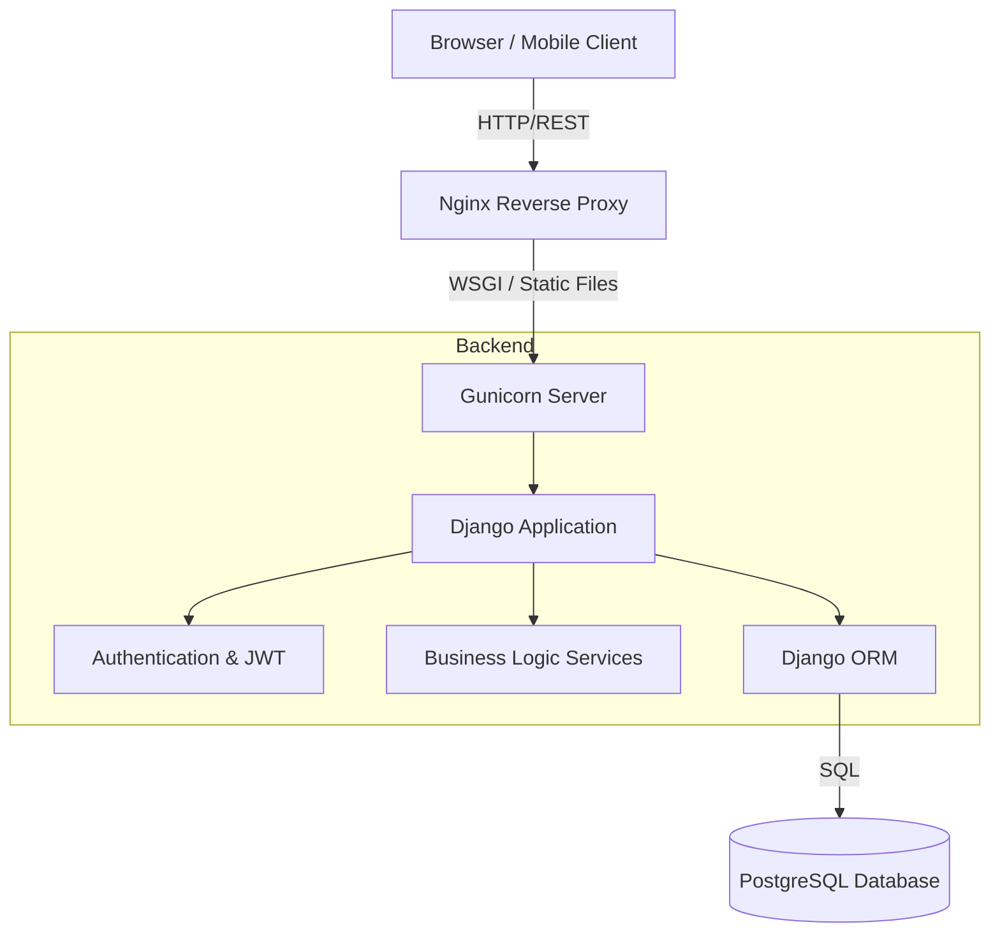
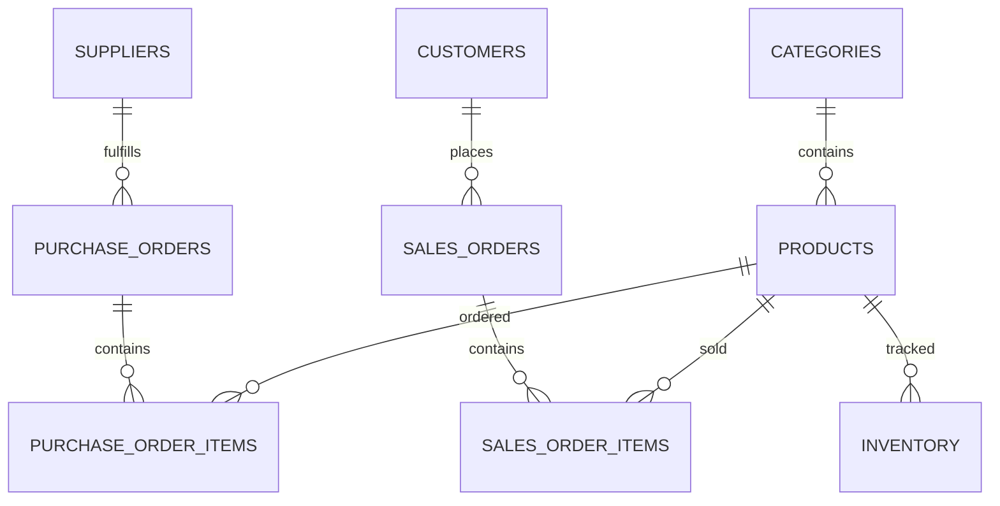

# Inventory Management System (Modular Monolith)

This project is a fully-featured, production-ready backend application developed for the Final Practical Assignment. It follows a strict **Modular Monolith** architecture and acts as a central hub for managing Products, Categories, Suppliers, Customers, Inventory, and Orders.

## Project Overview
The Inventory Management System provides both a **RESTful API** (for mobile apps or separate frontends) and a **Server-Side Rendered HTML Dashboard** (built exclusively with Django Templates and CSS, strictly prohibiting JavaScript as per requirements).

### Major Modules
1. **Accounts**: User authentication, registration, JWT handling, and Role-Based Access Control.
2. **Products**: Catalog management with image handling and category filtering.
3. **Categories**: Hierarchical organization of the product catalog.
4. **Suppliers**: Vendor and contact management.
5. **Customers**: Client directory for order fulfillment.
6. **Inventory**: Real-time stock ledgers, validation, adjustment, and automated deduction.
7. **Orders**: Multi-item order processing that interacts with the Inventory service layer.

---

## Technical Stack
- **Language**: Python 3.11+
- **Framework**: Django 5.1 & Django REST Framework
- **Database**: PostgreSQL (with Django ORM)
- **Authentication**: JWT (JSON Web Tokens) & Session Authentication
- **Deployment**: Docker, Gunicorn, Nginx

---

## Setup & Run Instructions

### 1. Local Development Setup (Virtual Environment)
```bash
# Clone and enter directory
cd Inventory-management-system

# Create and activate virtual environment
python -m venv venv
venv\Scripts\activate   # Windows
source venv/bin/activate # Mac/Linux

# Install requirements
pip install -r requirements.txt

# Migrate Database & Create Admin
python manage.py migrate
python create_admin.py

# Run Server
python manage.py runserver
```

### 2. Production Deployment (Docker)
The system is fully containerized and production-ready.
```bash
# Ensure Docker is running, then orchestrate the stack
docker-compose up --build -d
```
This automatically spins up:
- PostgreSQL database
- Gunicorn WSGI server running Django
- Nginx reverse-proxy serving static/media files

---

## Database Architecture
The PostgreSQL database is heavily normalized and utilizes proper relational mappings:
- **Foreign Keys**: Products belong to Categories and Suppliers. Orders belong to Customers. Order Items link Orders to Products.
- **Constraints**: `on_delete=models.PROTECT` is used extensively (e.g. you cannot delete a Category if Products rely on it).
- **Service Layer**: Database transactions are strictly handled via `@transaction.atomic` in `services.py` to ensure atomic state updates across multiple tables (e.g., deducting stock when an order is placed).

### System Architecture Diagram


### Entity-Relationship (ER) Diagram


---

## API Documentation

All endpoints are secured via JWT. Pass `Authorization: Bearer <your_token>` in the headers.

### Authentication (`/accounts/api/`)
- `POST /login/`: Obtain JWT Access & Refresh Tokens
- `POST /refresh/`: Refresh an expired access token
- `POST /register/`: Create a new user account

### Products (`/products/api/`)
- `GET /`: List all products (Supports searching and filtering)
- `POST /`: Create a product (Supports `multipart/form-data` for image uploads)
- `GET /<id>/`: Retrieve product details
- `PUT /<id>/`: Update product
- `DELETE /<id>/`: Delete product

*(Equivalent endpoints exist for Categories, Suppliers, Customers, Inventory, and Orders)*

---

## Testing Instructions
A comprehensive test suite is included, covering unit testing, API endpoint integration, validation logic, and authentication constraints.

```bash
# Run all tests
python manage.py test
```
The test suite validates:
- **Authentication**: Users cannot access secured endpoints without tokens.
- **Validation**: Stock cannot be adjusted below zero (Custom validation logic).
- **API Logic**: Successful CRUD operations through DRF routers.

---

## Backend Quality & Architecture Highlights
- **Decoupling via Signals**: `apps/inventory/signals.py` automatically writes a log entry whenever an inventory transaction occurs, decoupling logging logic from the core business logic.
- **Custom Service Layers**: Business logic (like Order fulfillment) is kept strictly out of Views/APIViews. It resides in `services.py`.
- **Query Optimization**: Extensive use of `select_related()` and `prefetch_related()` in Views to prevent N+1 query problems when fetching products and their categories.
- **Environment Configurations**: Sensitive keys are loaded via `.env` files and `python-dotenv`.

---

## FAQ & Presentation Guide

### 1. What is the use of this project? (The "Elevator Pitch")
This project is an **Enterprise Inventory Management System**. It allows a business to digitally track exactly how many products they have across multiple warehouses. It handles buying from suppliers, selling to customers, and keeps an unbreakable "Audit Trail" of every single stock movement to prevent stockouts and lost inventory.

### 2. How to explain the Code & Connections
The project uses a **3-Tier Architecture**:
1. **The User Interface (Frontend):** Django Templates + CSS. The browser sends a `POST` request to the server when a user interacts.
2. **The Brain (Backend):** The Django (Python) server receives the request, validates the data, and applies business logic.
3. **The Memory (Database):** Django uses its ORM to automatically generate SQL and safely save the data into a PostgreSQL database.

### 3. Why are we using Docker and Nginx?
* **Docker:** Wraps our entire project into a portable container. It guarantees the application will run exactly the same on any computer or server in the world without setup errors.
* **Nginx:** A blazing-fast web server that sits in front of Django. Nginx serves static files (CSS/Images) instantly to users and acts as a "Reverse Proxy" to route requests and protect Django from direct internet traffic.

### 4. How to Deploy to Render.com
Render is a highly popular cloud platform for deploying Django apps:
1. **Upload to GitHub:** Push all your project code to a public or private repository.
2. **Create Database:** Log into Render.com, create a "New PostgreSQL" instance, and copy the connection URL.
3. **Create Web Service:** Connect your GitHub repository to a "New Web Service" in Render.
4. **Set Commands:** 
   * Build Command: `pip install -r requirements.txt`
   * Start Command: `gunicorn config.wsgi:application`
5. **Set Environment Variables:** Add your `.env` variables into Render's settings.
6. **Deploy:** Render automatically builds and deploys your code, providing a live `.onrender.com` link!
