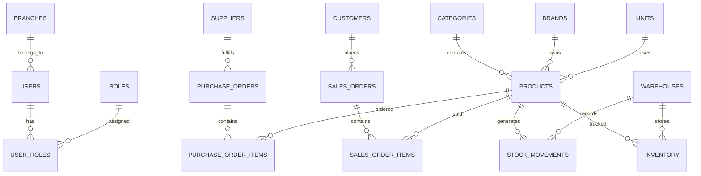

# Professional Inventory Management System - Database Architecture

## 1. Architecture Overview
The system follows a Modular Monolith architecture using Django and PostgreSQL. 
* **Backend Framework:** Django + Django REST Framework
* **Database:** PostgreSQL 16
* **Database Name:** `inventory_management_db`
* **Database User:** `inventory_user`
* **Authentication:** JWT (JSON Web Tokens)
* **Frontend Integration:** React.js via REST API

The architecture is divided into logical modules to maintain separation of concerns. Django's ORM serves as the bridge between the application logic and the normalized PostgreSQL schema.

---

## 2. Business Modules

Based on the requirements, the system is divided into the following core modules:

### A. Organization & Security
* **Purpose:** Handles multi-branch setup, RBAC (Role-Based Access Control), and system users.
* **Tables:** `users`, `roles`, `permissions`, `user_roles`, `branches`, `audit_logs`

### B. Product Master
* **Purpose:** Central catalog for all items, preventing data duplication.
* **Tables:** `products`, `categories`, `brands`, `units`

### C. Partner Management
* **Purpose:** Tracks external entities we buy from and sell to.
* **Tables:** `suppliers`, `customers`

### D. Inventory & Warehouse Management
* **Purpose:** The core engine tracking physical stock across multiple locations.
* **Tables:** `warehouses`, `inventory`, `stock_movements`, `stock_transfers`
* **Note:** Inventory will be tracked at the `product_id + warehouse_id` level to support multi-warehouse stock.

### E. Purchasing & Sales (Transactions)
* **Purpose:** Records the financial and physical acquisition/dispatch of goods.
* **Tables:** `purchase_orders`, `purchase_order_items`, `sales_orders`, `sales_order_items`

---

## 3. Overall ER Diagram



---

## 4. Core Entity Specifications (Initial Draft)

### Product Master (`products`)
| Column | Data Type | PK | FK | Nullable | Default | Unique | Description |
| ------ | --------- | -- | -- | -------- | ------- | ------ | ----------- |
| `id` | UUID | Yes | No | No | uuid4 | Yes | Unique identifier |
| `sku` | VARCHAR(100) | No | No | No | None | Yes | Stock Keeping Unit |
| `name` | VARCHAR(255) | No | No | No | None | No | Product name |
| `category_id` | UUID | No | Yes | No | None | No | Link to categories |
| `brand_id` | UUID | No | Yes | Yes | None | No | Link to brands |
| `cost_price` | NUMERIC(12,2)| No | No | No | 0.00 | No | Base purchasing cost |
| `selling_price`| NUMERIC(12,2)| No | No | No | 0.00 | No | Default selling price |
| `is_active` | BOOLEAN | No | No | No | True | No | Soft deletion flag |

### Inventory Ledger (`inventory`)
| Column | Data Type | PK | FK | Nullable | Default | Unique | Description |
| ------ | --------- | -- | -- | -------- | ------- | ------ | ----------- |
| `id` | UUID | Yes | No | No | uuid4 | Yes | Unique identifier |
| `product_id` | UUID | No | Yes | No | None | No | Link to products |
| `warehouse_id` | UUID | No | Yes | No | None | No | Link to warehouses |
| `quantity` | NUMERIC(12,3)| No | No | No | 0.000 | No | Actual physical stock |
| `reserved_qty` | NUMERIC(12,3)| No | No | No | 0.000 | No | Stock reserved for sales |

*Note: A unique composite index will be created on `(product_id, warehouse_id)` to prevent duplicate ledger entries.*

### Stock Movements (`stock_movements`)
| Column | Data Type | PK | FK | Nullable | Default | Unique | Description |
| ------ | --------- | -- | -- | -------- | ------- | ------ | ----------- |
| `id` | UUID | Yes | No | No | uuid4 | Yes | Unique identifier |
| `product_id` | UUID | No | Yes | No | None | No | Link to products |
| `warehouse_id` | UUID | No | Yes | No | None | No | Link to warehouses |
| `movement_type`| VARCHAR(50) | No | No | No | None | No | ENUM: PURCHASE, SALE, TRANSFER |
| `quantity` | NUMERIC(12,3)| No | No | No | None | No | Positive or Negative change |
| `reference_id` | VARCHAR(100) | No | No | Yes | None | No | ID of PO, SO, or Transfer |

---
## 5. PostgreSQL DDL Schema

Here is the exact production-ready PostgreSQL SQL to create the core inventory tables. We use `UUID` for primary keys and `NUMERIC(12,3)` for quantities to support fractional units.

```sql
-- Enable UUID extension
CREATE EXTENSION IF NOT EXISTS "uuid-ossp";

-- 1. Products Table
CREATE TABLE products (
    id UUID PRIMARY KEY DEFAULT uuid_generate_v4(),
    sku VARCHAR(100) UNIQUE NOT NULL,
    name VARCHAR(255) NOT NULL,
    category_id UUID REFERENCES categories(id) ON DELETE SET NULL,
    cost_price NUMERIC(12,2) NOT NULL DEFAULT 0.00,
    selling_price NUMERIC(12,2) NOT NULL DEFAULT 0.00,
    is_active BOOLEAN NOT NULL DEFAULT TRUE,
    created_at TIMESTAMP WITH TIME ZONE DEFAULT CURRENT_TIMESTAMP,
    updated_at TIMESTAMP WITH TIME ZONE DEFAULT CURRENT_TIMESTAMP
);

-- 2. Warehouses Table
CREATE TABLE warehouses (
    id UUID PRIMARY KEY DEFAULT uuid_generate_v4(),
    code VARCHAR(50) UNIQUE NOT NULL,
    name VARCHAR(255) NOT NULL,
    is_active BOOLEAN NOT NULL DEFAULT TRUE
);

-- 3. Inventory Ledger (Tracks current stock)
CREATE TABLE inventory (
    id UUID PRIMARY KEY DEFAULT uuid_generate_v4(),
    product_id UUID NOT NULL REFERENCES products(id) ON DELETE CASCADE,
    warehouse_id UUID NOT NULL REFERENCES warehouses(id) ON DELETE CASCADE,
    quantity NUMERIC(12,3) NOT NULL DEFAULT 0.000 CHECK (quantity >= 0),
    reserved_qty NUMERIC(12,3) NOT NULL DEFAULT 0.000 CHECK (reserved_qty >= 0),
    UNIQUE(product_id, warehouse_id) -- A product can only have one row per warehouse
);

-- 4. Stock Movements (Immutable audit trail of all changes)
CREATE TABLE stock_movements (
    id UUID PRIMARY KEY DEFAULT uuid_generate_v4(),
    product_id UUID NOT NULL REFERENCES products(id) ON DELETE RESTRICT,
    warehouse_id UUID NOT NULL REFERENCES warehouses(id) ON DELETE RESTRICT,
    movement_type VARCHAR(50) NOT NULL, -- e.g., 'PURCHASE', 'SALE', 'ADJUSTMENT'
    quantity NUMERIC(12,3) NOT NULL,
    reference_id VARCHAR(100), -- ID of the order that caused this
    created_at TIMESTAMP WITH TIME ZONE DEFAULT CURRENT_TIMESTAMP,
    created_by UUID REFERENCES users(id) ON DELETE SET NULL
);
```

---

## 6. Django Model Implementation

Here is how the above PostgreSQL schema translates perfectly into Django ORM Models:

```python
import uuid
from django.db import models
from django.conf import settings

class Product(models.Model):
    id = models.UUIDField(primary_key=True, default=uuid.uuid4, editable=False)
    sku = models.CharField(max_length=100, unique=True)
    name = models.CharField(max_length=255)
    cost_price = models.DecimalField(max_digits=12, decimal_places=2, default=0.00)
    selling_price = models.DecimalField(max_digits=12, decimal_places=2, default=0.00)
    is_active = models.BooleanField(default=True)
    
    created_at = models.DateTimeField(auto_now_add=True)
    updated_at = models.DateTimeField(auto_now=True)

    class Meta:
        db_table = 'products'
        indexes = [
            models.Index(fields=['sku']),
            models.Index(fields=['name']),
        ]

class Warehouse(models.Model):
    id = models.UUIDField(primary_key=True, default=uuid.uuid4, editable=False)
    code = models.CharField(max_length=50, unique=True)
    name = models.CharField(max_length=255)
    is_active = models.BooleanField(default=True)

    class Meta:
        db_table = 'warehouses'

class Inventory(models.Model):
    id = models.UUIDField(primary_key=True, default=uuid.uuid4, editable=False)
    product = models.ForeignKey(Product, on_delete=models.CASCADE, related_name='inventory_records')
    warehouse = models.ForeignKey(Warehouse, on_delete=models.CASCADE, related_name='inventory_records')
    quantity = models.DecimalField(max_digits=12, decimal_places=3, default=0.000)
    reserved_qty = models.DecimalField(max_digits=12, decimal_places=3, default=0.000)

    class Meta:
        db_table = 'inventory'
        constraints = [
            models.UniqueConstraint(fields=['product', 'warehouse'], name='unique_product_warehouse')
        ]

class StockMovement(models.Model):
    class MovementType(models.TextChoices):
        PURCHASE = 'PURCHASE', 'Purchase'
        SALE = 'SALE', 'Sale'
        ADJUSTMENT = 'ADJUSTMENT', 'Adjustment'
        TRANSFER = 'TRANSFER', 'Transfer'

    id = models.UUIDField(primary_key=True, default=uuid.uuid4, editable=False)
    product = models.ForeignKey(Product, on_delete=models.RESTRICT)
    warehouse = models.ForeignKey(Warehouse, on_delete=models.RESTRICT)
    movement_type = models.CharField(max_length=50, choices=MovementType.choices)
    quantity = models.DecimalField(max_digits=12, decimal_places=3)
    reference_id = models.CharField(max_length=100, null=True, blank=True)
    
    created_at = models.DateTimeField(auto_now_add=True)
    created_by = models.ForeignKey(settings.AUTH_USER_MODEL, on_delete=models.SET_NULL, null=True)

    class Meta:
        db_table = 'stock_movements'
        indexes = [
            models.Index(fields=['product', 'warehouse', '-created_at']),
        ]
```

---
## 7. Transaction Management & Workflows

Inventory updates are highly prone to **race conditions** if multiple users try to buy or sell the same product at the exact same millisecond. To prevent negative inventory, Django must use `transaction.atomic()` combined with `select_for_update()`.

### Inventory Service Example (Safe Deduction)

```python
from django.db import transaction
from django.core.exceptions import ValidationError

def deduct_inventory(product_id, warehouse_id, quantity_to_deduct, user):
    with transaction.atomic():
        # Lock the specific inventory row so no other request can modify it simultaneously
        inv = Inventory.objects.select_for_update().get(
            product_id=product_id, 
            warehouse_id=warehouse_id
        )
        
        if inv.quantity < quantity_to_deduct:
            raise ValidationError("Insufficient stock!")
            
        # 1. Update Inventory Ledger
        inv.quantity -= quantity_to_deduct
        inv.save()
        
        # 2. Record the Immutable Stock Movement (Audit Trail)
        StockMovement.objects.create(
            product_id=product_id,
            warehouse_id=warehouse_id,
            movement_type=StockMovement.MovementType.SALE,
            quantity=-quantity_to_deduct,
            created_by=user
        )
```
*Because this is wrapped in `transaction.atomic()`, if either step fails, the entire database rolls back, ensuring stock levels are never corrupted.*

---

## 8. Business Workflows

### A. Purchase Workflow (Adding Stock)
1. **Purchase Order Created** (`Status: DRAFT`)
2. **Purchase Order Approved** (`Status: APPROVED`)
3. **Goods Receipt Generated** (`Status: RECEIVED`)
4. **Action:** Loop through received items and call `add_inventory()`
5. **Result:** Inventory quantity increases, and a `PURCHASE` Stock Movement is logged.

### B. Sales Workflow (Deducting Stock)
1. **Sales Order Created** (`Status: DRAFT`) - *Optionally reserve stock here.*
2. **Sales Order Confirmed** (`Status: CONFIRMED`)
3. **Invoice/Dispatch Generated** (`Status: DISPATCHED`)
4. **Action:** Loop through dispatched items and call `deduct_inventory()`
5. **Result:** Inventory quantity decreases, and a `SALE` Stock Movement is logged.

### C. Transfer Workflow (Moving Stock)
1. **Stock Transfer Created** (`Status: PENDING`)
2. **Action:** Call `deduct_inventory()` on Warehouse A.
3. **Action:** Call `add_inventory()` on Warehouse B.
4. **Result:** Two `TRANSFER` Stock Movements are created (one negative, one positive).

---

## 9. Audit Logging (System-Wide)

Beyond just stock movements, the system requires tracking of who changed what across all master data (Products, Users, Suppliers). 

### Audit Log Schema

```sql
CREATE TABLE audit_logs (
    id UUID PRIMARY KEY DEFAULT uuid_generate_v4(),
    user_id UUID REFERENCES users(id) ON DELETE SET NULL,
    action VARCHAR(50) NOT NULL, -- 'CREATE', 'UPDATE', 'DELETE'
    table_name VARCHAR(100) NOT NULL,
    record_id VARCHAR(100) NOT NULL,
    old_values JSONB, -- Stores the JSON representation before change
    new_values JSONB, -- Stores the JSON representation after change
    ip_address INET,
    created_at TIMESTAMP WITH TIME ZONE DEFAULT CURRENT_TIMESTAMP
);
```

By utilizing PostgreSQL's `JSONB` data type, we can store dynamic payloads of whatever data changed without needing strict columns.

---

## 10. Sample Business Scenario Validation

Let's simulate a real-world scenario to prove the architecture:
**Scenario:** 
* Opening Stock of "Laptop" in Warehouse A: 100
* We Purchase 50.
* We Sell 20.
* We Transfer 30 to Warehouse B.

**Database Execution:**
1. `Inventory(Warehouse A)` = 100
2. `Purchase (+50)` -> `Inventory(Warehouse A)` becomes 150. `StockMovement` logs +50.
3. `Sale (-20)` -> `Inventory(Warehouse A)` becomes 130. `StockMovement` logs -20.
4. `Transfer (-30)` -> `Inventory(Warehouse A)` becomes 100. `StockMovement` logs -30.
5. `Transfer Receipt (+30)` -> `Inventory(Warehouse B)` becomes 30. `StockMovement` logs +30.

**Validation:**
If we sum all `quantity` values in `StockMovement` for Warehouse A: `100 + 50 - 20 - 30 = 100`.
This perfectly matches the `quantity` stored in the `Inventory` ledger table, proving absolute data integrity!

---
*This concludes the core architectural design for the Inventory Management System.*
