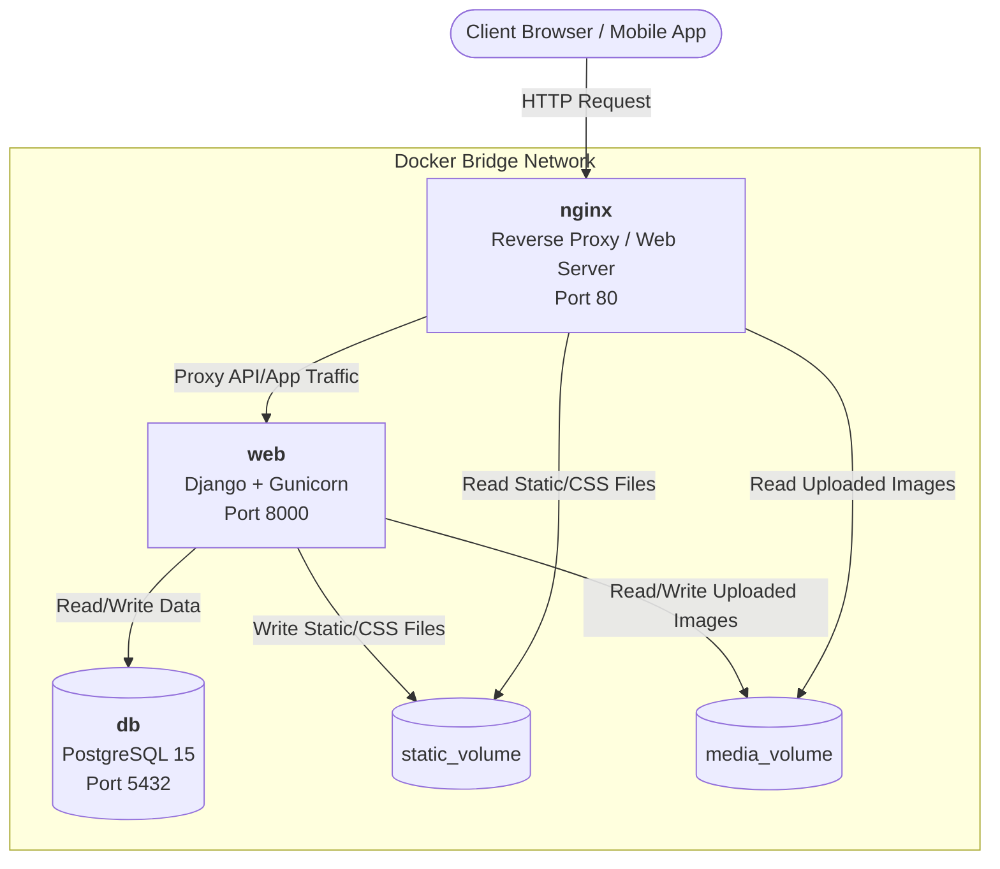

# Docker Architecture: Inventory Management System

This document outlines the containerized architecture of our Inventory Management System. The application is orchestrated using `docker-compose` and is split into a **3-tier microservice architecture**, ensuring separation of concerns, scalability, and high availability.

## 1. System Architecture Diagram

---

## 2. Service Breakdown

The `docker-compose.yml` file spins up three distinct containers:

### A. The Reverse Proxy (`nginx`)
- **Image**: Official `nginx:latest`
- **Role**: Acts as the gatekeeper for our application. It receives all incoming HTTP traffic on port `80`.
- **Functionality**:
  - Intercepts requests for static files (like CSS and JavaScript) and media files (like uploaded product images) and serves them directly to the client at blazing fast speeds.
  - Acts as a **Reverse Proxy**: If the request is for an application route or API endpoint, Nginx securely forwards the request to the backend `web` container.

### B. The Application Server (`web`)
- **Image**: Custom image built from our `Dockerfile` (using `python:3.11-slim`).
- **Role**: The core backend application server.
- **Functionality**:
  - Runs our Django application using **Gunicorn** (a robust Python WSGI HTTP Server for UNIX) bound to port `8000`.
  - When the container starts, it automatically runs `collectstatic` to gather all CSS/JS files and runs `migrate` to ensure the database schema is up-to-date.
  - Processes all business logic, authenticates users, and interacts with the database.

### C. The Database (`db`)
- **Image**: Official `postgres:15`
- **Role**: Relational Database Management System.
- **Functionality**:
  - Stores all relational data (Users, Products, Orders, Inventory logs).
  - Listens on port `5432`. It is completely isolated from the public internet and is only accessible by the `web` container within the internal Docker network.

---

## 3. Data Persistence (Docker Volumes)

Because Docker containers are ephemeral (data inside them is lost when the container is deleted), we use **Named Volumes** to guarantee data persistence:

1. **`postgres_data`**: Mapped to `/var/lib/postgresql/data` inside the `db` container. This ensures that even if our database container crashes or is updated, our actual database records are permanently saved on the host machine.
2. **`static_volume`**: Shared between the `web` and `nginx` containers. When the Django `web` container starts up, it gathers all CSS files and puts them here so Nginx can read and serve them to users.
3. **`media_volume`**: Shared between the `web` and `nginx` containers. When a user uploads a product image via the Django app, it is saved here so Nginx can instantly serve it on the frontend.

## 4. Environment Configuration
The architecture heavily utilizes environment variables injected into the `web` container at runtime. This allows us to securely pass database credentials (`DB_USER`, `DB_PASSWORD`) and production settings (`SECRET_KEY`, `DEBUG=False`) without hardcoding them into the codebase.
